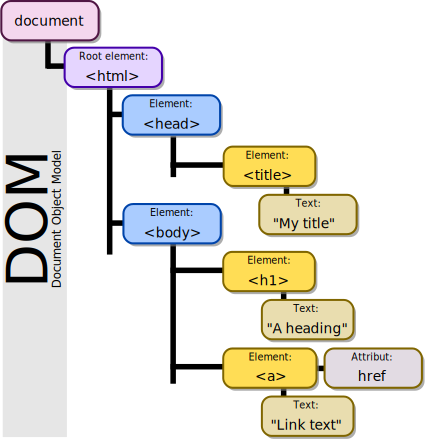

# Interacting with HTML/CSS: Working with the DOM

 ◇─◇──◇────◇────◇────◇────◇────◇─◇─◇
 

#### On this page:

1. What is the DOM?
2. Create Paragraphs
3. Create Buttons
4. Using Input Fields
5. Doing stuff to the HTML/CSS
6. Selecting HTML elements
7. Video
8. Class demos
9. Class exercise

References and tutorials:

dom tut: https://github.com/processing/p5.js/wiki/Beyond-the-canvas

[p5.dom library now included as sub-section in main reference page](https://p5js.org/reference/#group-DOM)
---
 

## ▼△▼△▼ What is the DOM?

DOM stands for Document Object Model. It is a tree structure for identifying parts of a webpage. Each node is an object representing part of the document (ie. the body, the heading, a link, an image)

 

Using the [p5.dom library](https://p5js.org/reference/#group-DOM), you can have your p5 sketch interact with the HTML on a webpage. Without the p5.dom library, your p5 canvas is independent of the rest of the HTML. With access to the DOM, you can dynamically create buttons, input fields, sliders, headers, text, etc — outside the canvas.

Better yet, you can access user input and store them as variables in your p5 sketch.    

 

## ▼△▼△▼ Create Paragraphs

[createP()](https://p5js.org/reference/#/p5/createP)

ie. createP('this is some text');

- exercise in dynamically creating p elements
- write text to array then display in forloop

## ▼△▼△▼ Create buttons

[createButton()](https://p5js.org/reference/#/p5/createButton)

***Note:*** *In the online demo, they store the button created in a variable... That way you can call methods to it! Like button.mousePressed()*

- try having something appear in canvas when button is pushed...

## ▼△▼△▼ Using input fields

[createInput()](https://p5js.org/reference/#/p5/createInput) -> create an input field!

[Cool example on input and buttons](https://p5js.org/examples/dom-input-and-button.html)
- Users can input their name as text =)

## ▼△▼△▼ Doing stuff to the HTML/CSS - the P5 Element

When you store a DOM element in a variable, it becomes a P5 Element. There are all kinds of methods and attributes you can now call to change the HTML and CSS!

Change the class, parent, CSS, have stuff happen when it's clicked, when the mouse is over it, etc!

**Check out the full list in the [P5 Element documentation](https://p5js.org/reference/#/p5.Element) - these are SUPER important and tucked away in the documentation.**

## ▼△▼△▼ Selecting HTML elements

Rather than create elements (like buttons, etc) from within the p5, it is often easier to create them IN YOUR HTML, then SELECT them in the p5.

To do this, use the [select() function](https://p5js.org/reference/#/p5/select)

Syntax:

  htmlButton = select('#myButton');

This will select a button with the id="myButton". Once it is selected, you can [do stuff to it](https://p5js.org/reference/#/p5.Element) from within your p5 sketch.

  htmlButton.style('font-size', '18px')

## ▼△▼△▼ Video

Work with video: Check out [this p5 demo](https://p5js.org/examples/dom-video.html)

## ▼△▼△▼ Class demos

Check out some of the demos in the [class webpage](https://larkvcr.com/art101/)

Specifically:
* [Styling CSS with the p5 DOM library](https://larkvcr.com/art101/demos/04_DOM-CSS/)
  - Download zip of code [here](https://larkvcr.com/art101/demos/04_DOM-CSS.zip)

## ▼△▼△▼ Class Exercise

Try adding buttons to your randomizer and/or drawing machine. These can control the functions that you had mapped to keypresses.

For example, instead of saving the image by hitting 's', you can add a button to do it!
